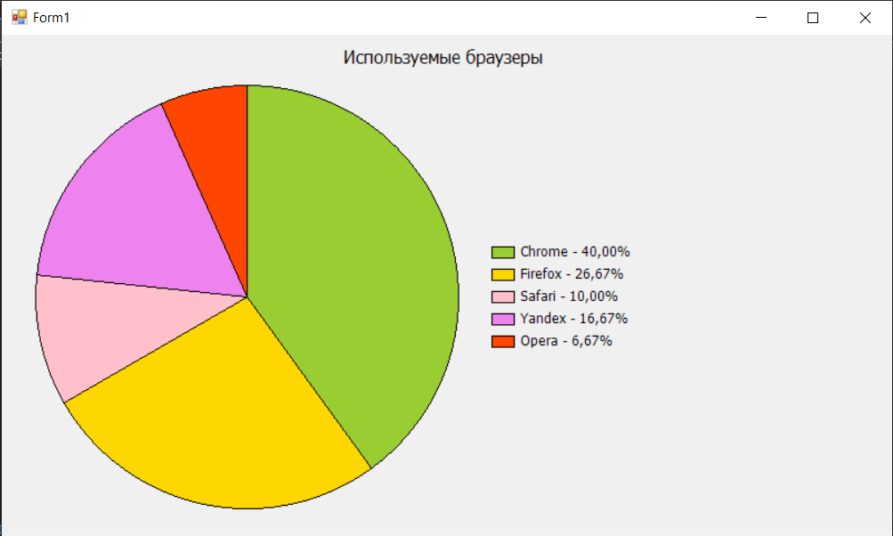
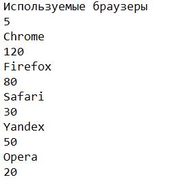

# Задание
| Вариант    | Название | Задание |
| ---------- | ---------| ------- |
| Вариант 16 | Круговая диаграмма | В окне программы круговая диаграмма отображаются результаты социологического опроса |

# Результат
  

# Данные
- Данные для диаграммы находятся в файле `date.dat`  
